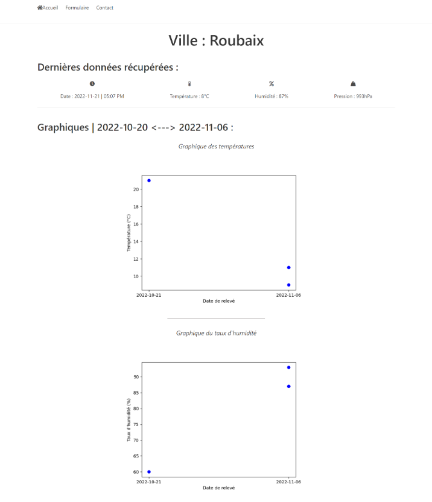

<div align="center">
  <h1 align="center">Weather Application</h1>
    <p align="center">
    A Weather web application, built with Python & Flask
</div>

## About The Project

This project was created as part of a university course. It provides a user-friendly interface to input a city name and receive the current temperature in Celsius.

## Built With

[](https://www.python.org/)  
[](https://flask.palletsprojects.com/)  
[](https://www.sqlite.org/)  

## Getting Started

### Folder Structure

```markdown
weather-app/
├── 📁 static/               # Static files (CSS, JavaScript, images)
├── 📁 templates/            # HTML templates
├── 📄 .env                  # Environment variables
├── 📄 .gitignore            # Git ignore file
├── 📄 app.py                # Main application file
├── 📄 basedonnee.py         # Data handling script
├── 📄 bd.sqlite             # SQLite database
├── 📄 logs.txt              # Application logs
├── 📄 visualisationDonnees.py # Data visualization script
└── 📄 README.md             # Project documentation
```

### Prerequisites

Ensure you have the following installed:

```sh
Python 3.9+
pip
```

### Installation & Build

1. Clone the repository:

```sh
git clone https://github.com/JulesBobeuf/weather-app.git
cd weather-app
```

2. Install dependencies:

```sh
pip install -r requirements.txt
```

3. Set up environment variables:

```sh
cp .env.example .env
```

4. Run the application:

```sh
python app.py
```

### Running the Application

After setting up, navigate to `http://localhost:5000` in your browser to view the application.

## License

This project is licensed under the MIT License. See the [LICENSE](LICENSE) file for details.

## Contact

Jules Bobeuf  
[LinkedIn](https://www.linkedin.com/in/bobeuf-jules/)  
bobeuf.jules@gmail.com

Aymeric Jakobowski  
[LinkedIn](https://www.linkedin.com/in/aymeric-jakobowski/)  
[GitHub](https://github.com/AymericJak)
